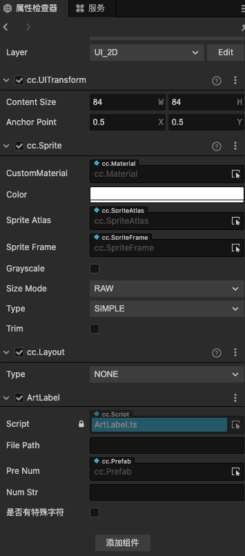
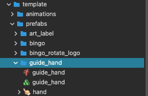
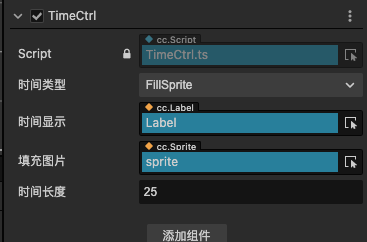
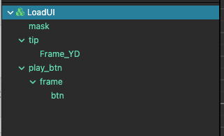

# 功能模块
PAT封装了试玩制作中高频使用的功能模块，例如Bingo游戏的报数、bingo主面板;Slot游戏主机台；以及一些通用的功能如：不会打断合批的艺术字体组件、引导手指、常用的倒计时功能等等。下面会一一介绍。
## 通用组件
通用组件是指适用于各品类游戏的组件。
### 艺术字体
资源路径：template/prefabs/art_label 
 
- file path:艺术字体的资源路径，该资源为动态加载的资源，所以需要放在resources目录下。
- pre num:单个字体的预制
- 要显示的字体（数字）
- 是否有特殊字符：如果有ts的特殊字符，勾选该选项后可把特殊字符替换成其他不冲突的字符
📝备注：</b>
1.由于该组件是简单的脚本驱动，要求字体图片等宽高 
2.该组件是位图字体应用的备选方式，如果对合批无高要求使用位图字体更方便
### 引导点击手指
试玩制作中常用到手指来引导点击，这里把手指点击的动画做成了预制，随取随用 
资源路径：template/prefabs/guide_hand 

### 倒计时组件
休闲品类如BINGO、MTS、MTD、MMR等经常会有倒计时的效果，这里把倒计时的功能和效果统一封装了一下。 
资源路径：template/prefabs/time_node 
 
倒计时类型可以选择，目前直接遮罩进度类型、进度条类型以及图片填充类型 
在控制脚本TimeCtrl中可监听或调用倒计时的开始、停止、暂停、恢复等功能
### GameUI组件
资源路径：template/prefabs/ui/GameUI 
一个空的、widget适配全屏的节点
### LoadUI组件
资源路径：template/prefabs/ui/LoadUI 
 
一个常用在开头的文案引导页面，有一个文案提示和一个开始按钮。一般常用于BINGO、MTS等休闲游戏的开头。
### EndUI组件
资源路径：template/prefabs/ui/EndUI 
### hw_endui
基于HW游戏的一个通用的落地页效果
### mmr_endui
基于MMR游戏的一个通用的落地页效果
### mtd_endui
基于MTD游戏的一个通用的落地页效果，该界面已做自适配，如果需要可在MtdEndCard脚本中调整
### 失败效果
一个失败的效果，常用于MTS等休闲游戏 
资源路径：template/prefabs/fail_eff 
### 喷洒金币效果coins
一个喷洒金币的效果，可视化编辑属性，以达成如单边飘落，双边飘落，满屏飘落、单边喷洒、双边喷洒等效果 
资源路径：template/prefabs/coins 
### 星光效果star1
一个四散星光的粒子效果（MTS｜BINGO等高频使用） 
资源路径：template/prefabs/particle_effs/stars1 
### 星光效果star2
一个满屏星光的粒子效果（MTS|BINGO等高频使用） 
资源路径：template/prefabs/particle_effs/stars2 
### 落叶效果
一个飘落叶的效果（MTS|BINGO等高频使用） 
资源路径：template/prefabs/particle_effs/leaf_eff 
### 落叶效果
一个落雨的效果，用于下雨天场景 
资源路径：template/prefabs/particle_effs/rain_eff 
### 喷彩带效果caidai1
一个可满足从屏幕左右两边喷出彩带的效果 
资源路径：template/prefabs/particle_effs/caidai1 
### 烟花效果yanhua1
一个多烟花的效果 
资源路径：template/prefabs/yanhua1 
## BINGO常用组件
- BingoCalledBall：Bingo游戏报数球的UI和控制脚本（复用）
- BingoCalledFrame：Bingo游戏报数球的区域UI模版和控制脚本
- BingoCardFrame：Bingo卡的UI和控制脚本，支持多卡
- BingoCardItem：Bingo卡的元素UI和控制脚本，包含了卡片的交互逻辑
- bingo_rotate_logo：一个通用的旋转地球 + Logo的效果
## Slot常用组件
- slot_frame：slot机台UI和控制脚本
- slot_item：slot机台元素和控制脚本
- slot_list:slot_item的容器
- slot_money_group:一组可以滚动的数字（奖金）UI和控制脚本

## Wsp常用组件
通用组件是指适用于各品类游戏的组件。
## MTS常用组件
通用组件是指适用于各品类游戏的组件。
## MTD常用组件
通用组件是指适用于各品类游戏的组件。
## MMR常用组件
通用组件是指适用于各品类游戏的组件。
## 代码块
### 多分辨率适配
AdaptCtrl.ts，控制屏幕和屏幕元素的适配，无需添加，默认挂载在adaptCtrl节点上 
资源路径：template/scripts/ctrls/AdaptCtrl 
### 多相机控制
CameraCtrl.ts,分层相机，无需添加，默认挂载在CameraCtrl节点上。 
资源路径：template/scripts/ctrls/CameraCtrl 
### 事件传递
EventCtrl.ts，该模版中的事件传递使用Creator内置的EventTarget管理。实例名：EventCtrl
* 监听：EventCtrl.on
* 派发：EventCtrl.emit
* 事件类型：事件类型定义在Enum文件中 
资源路径：template/scripts/ctrls/EventCtrl
### 游戏控制
GameCtrl.ts，控制游戏的开始、进行、结束，默认挂载在gameCtrl节点上。 
资源路径：template/scripts/ctrls/GameCtrl
### 游戏数据
单例模式。 
游戏的通用/分类数据都在这里。
### Enum枚举
游戏中的枚举类型基本都在这里，包括事件类型，游戏分类、声音等等。
### 音频管理
AudioMgr && AudioMgr2 
单例模式 
支持播放音效、播放可打断音效、播放背景音乐、切换背景音乐、音乐的渐隐和渐出、音效控制（播放/暂停/恢复/停止） 
### 资源管理
ResMgr 
单例模式 
支持选择游戏分类、支持BINGO报数球、卡片背景；支持SlotItemIcons；支持MTS/MMR等item;支持编辑器中拖拽音频资源。
### 工具集
Utils 
- AdaptBg:全屏适配脚本，拖拽到需要适配的节点上即可
- BreathTween:呼吸缓动脚本，拖拽到需要该效果的节点上，该节点就会做一个呼吸动画
- CustomBtn:自定义按钮组件，拖拽到目标节点上，支持响应事件、下载、音效控制
- FirstOpt:Web平台首次交互处理
- NumScrolling：滚动数字效果，拖拽到目标节点上会有一个数字滚动的效果，在slot游戏中经常使用。支持可视化编辑参数。
- PlayableConfig：PlayableConfig
- Utils：常用算法，如：格式化数字、贝塞尔曲线、三角函数算法等

## animations
- breath_clip:一个可循环的呼吸动画
- end_btn1:一个循环跳动的动画，适用于DownLoad，Collect等按钮
- route_light:一个循环旋转的效果，常用于光效的旋转
- slide_hand:一个手指滑动的效果，常用于手指引导
## effect
shader特效 
- gaosimohu：高斯模糊特效
- water:2D水面波纹特效