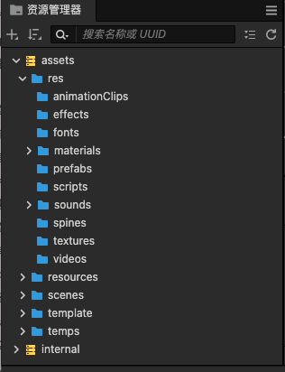
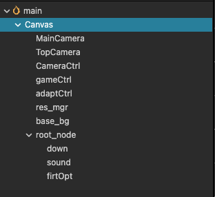
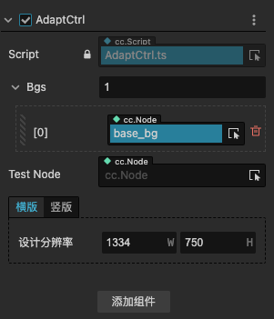
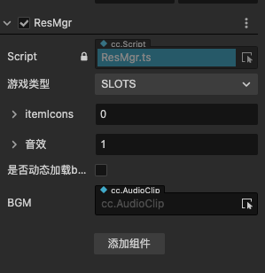
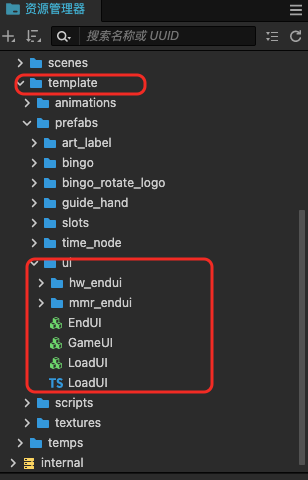

# 快速开始

## 创建项目
PlayAble-Example2D-3.7.4已添加到CocosDashBoard,打开dashBoard后新建项目 

## 模版目录结构
新建项目的目录结构如下： 
 
- res:资源目录
    - animationClips:帧动画
    - effects:shader
    - fonts:字体资源
    - materials:材质资源
    - prefabs:预制体
    - scripts:脚本资源
    - sounds:音频资源
    - spines:骨骼动画资源
    - textures:图片资源
    - videos:视频资源
- resources:默认boundle,存放了Bingo的报数球音效
- scenes:场景资源，一般情况下只有一个场景
- template:项目模版，存放了即拿即用的动效、自定义组件、常用图片等资源
- temps:临时文件夹，一般临时存放美术设计图
## 默认的场景树
 
+ 相机和相机控制
场景中默认添加了两个相机，MainCamera渲染大部分的场景资源，TopCamera用于渲染一直在顶层的资源（如音效控制按钮等），主要是针对Slot等一些需要变换MainCamera的效果，相机已做好适配，无需添加其他的适配脚本或属性。 
CameraCtrl节点挂载了CameraCtrl脚本，单例模式可获取<b>主相机</b>和<b>顶相机</b>，脚本中有适配相机的代码
+ 主逻辑驱动
gameCtrl节点挂载了主逻辑驱动的脚本GameCtrl,控制游戏的开始、进行、结束
+ 多分辨率适配
adaptCtrl节点挂载了场景适配的脚本AdaptCtrl,场景以及场景元素的适配都在这里处理： 
 
提供了<b>750x1334</b>以及<b>1334x750</b>的屏幕适配方案，可视化更改屏幕分辨率，无需添加其他代码
+ 资源管理
游戏中不需要加载资源在res_mgr节点挂载的ResMgr中管理，可视化添加各种组件或元素需要的资源，如音频资源、报数球、slot的元素icon等。 
 
+ 默认背景
base_bg是一个默认的精灵节点，替换精灵帧即可替换背景，基本所有的项目通用，所以就默认创建了一个节点。
+ root_node
root_node主要是下载按钮、音效按钮、以及web平台首次交互处理的部分
+ 添加场景
因为试玩制作设计的是单场景，如果想要添加如开头的文案引导场景、游戏主场景、EndCard，可以在<b>资源管理目录下取用</b>： 

